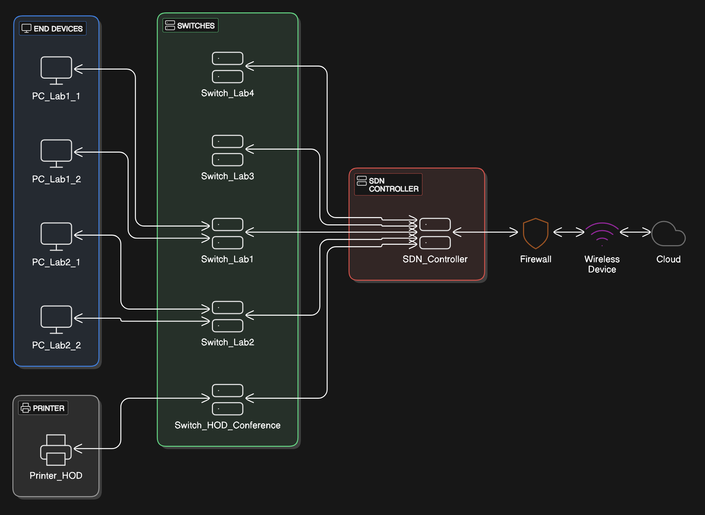
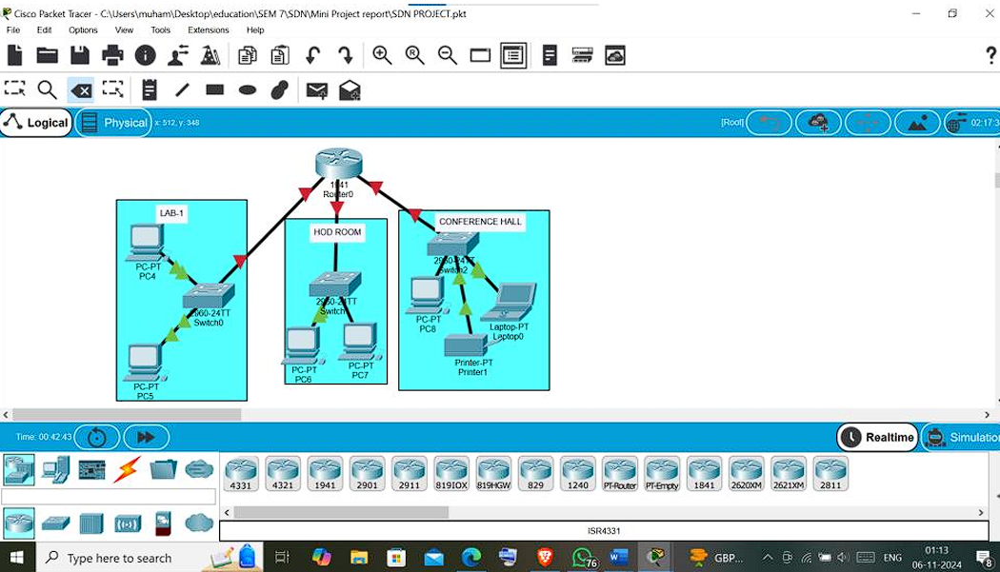
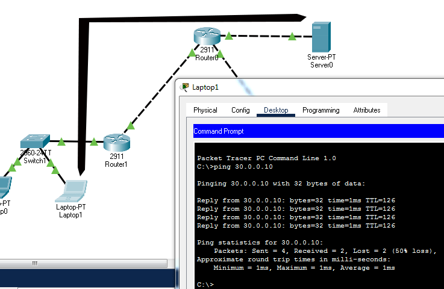

# SDN-Inspired Secure Campus Network Design (Cisco Packet Tracer)

This repository contains a **mini-project focused on the design and simulation of a secure campus network topology for our university IT department**, inspired by **Software Defined Networking (SDN)** architectural concepts. The network was **designed and validated using Cisco Packet Tracer** as part of an academic mini-project.

> ⚠️ **Important Note:**  
> ⚠️ *This work focuses strictly on **network design and simulation** and does **not include real-world SDN controller implementation or programmable network devices**.*

---

## 📄 Abstract

This project presents a secure campus network topology for  our university IT department, designed and simulated using Cisco Packet Tracer, inspired by Software Defined Networking (SDN) architectural concepts. The network includes multiple IT labs, administrative offices, and a conference hall, all segmented using VLANs and interconnected through a **Router-on-a-Stick configuration with RIP as the dynamic routing protocol**. The design demonstrates **centralized monitoring concepts, secure subnet isolation**, and **verified inter-department communication using ICMP testing**. This work focuses only on **network design and simulation**, without real-world SDN controller implementation.

---

## 📌 Project Objectives

- Design a **secure campus network** for our university IT department  
- Apply **SDN-inspired centralized architectural concepts**  
- Implement **VLAN-based segmentation**  
- Enable **inter-VLAN routing using RIP**  
- Simulate and **verify connectivity using Cisco Packet Tracer**

---

## 🏗️ SDN Architecture Overview

The network follows a **three-layer SDN-inspired model**:

- **Application Layer** – Network monitoring & logical control (conceptual)
- **Control Layer** – SDN Controller (conceptual)
- **Infrastructure Layer** – Routers, switches, PCs, printers

### 🔹 SDN Architecture Diagram

---

## 🌐 Network Topology Design

The simulated network represents multiple labs, a HoD room, and a conference hall connected via routers and switches.

### 🔹 Campus Network Topology

---

## 📊 Simulation & Verification

Basic network connectivity and routing were validated using:

- ICMP ping tests
- RIP routing configuration

### ✅ Ping Verification Result

### ✅ RIP Routing Command

---

## 🛠 Tools & Technologies Used

- Cisco Packet Tracer  
- Routing Information Protocol (RIP)  
- ICMP (Ping Testing)  
- SDN Conceptual Architecture  
- Network Topology Design  

---

## 👥 Project Nature & Contributions

This was a **team project** completed collaboratively.

### ✅ Equal Contribution By:
- **[Noorul Hassan](https://github.com/noorul23)**  
- **[Muhammad Thahir](https://github.com/Thahir25)**  

Both contributors were **equally involved** in:
- Network topology design
- SDN architecture mapping
- Packet routing configuration
- Simulation testing & verification
- Documentation & presentation preparation

---

## 📚 References

The following research works were studied for conceptual understanding:

[1] H. Kim and N. Feamster, "Improving network management with software defined networking," IEEE Communications Magazine, vol. 51, no. 2, pp. 114-119, 2013. doi: 10.1109/MCOM.2013.6461195.

[2] Open Networking Foundation, Software-Defined Networking: The New Norm for Networks, 2012. [Online]. Available: https://opennetworking.org/sdn-resources/sdn-definition

[3] T. Benson, A. Akella, and D. A. Maltz, "Network traffic characteristics of data centers in the wild," Proceedings of the 10th ACM SIGCOMM Conference on Internet Measurement, Melbourne, Australia, 2010, pp. 267–280. doi: 10.1145/1879141.1879175.

[4] A. Shalimov, D. Zimarina, A. Zuikov, V. Pashkov, and R. Smeliansky, "Advanced study of OpenFlow-based Software-Defined Networks," in Proceedings of the 9th Central and Eastern European Software Engineering Conference in Russia (CEE-SECR '13), Moscow, Russia, 2013, pp. 1–6. doi: 10.1145/2556610.2556627.
 

(References were used strictly for academic learning purposes.)

---

## 👨‍💻 Contributors

- **[Noorul Hassan](https://github.com/noorul23)**
- **[Muhammad Thahir](https://github.com/Thahir25)**

---

If you find this project useful, feel free to ⭐ the repository!
